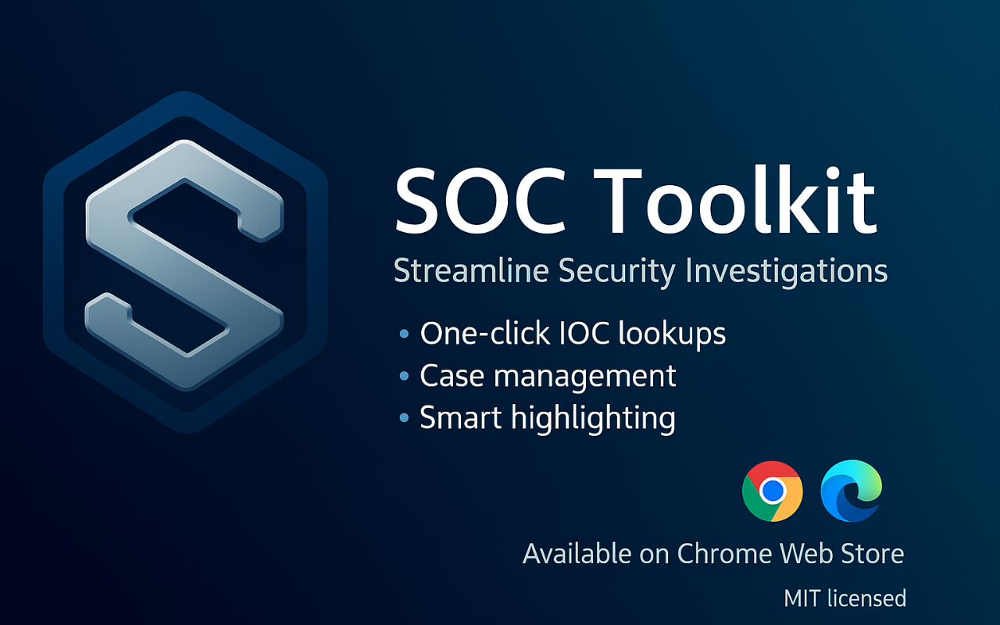

  
  <h1>SOC&nbsp;Toolkit</h1>
  <em>The Swiss-army-knife browser extension for <strong>Security Operations Center</strong> analysts.</em> 
  

  
  
  

> **SOC Toolkit** turbo-charges day-to-day investigations: *highlight → right click → instant enrichment*.  
> Say goodbye to endless copy-and-paste and hello to focused, repeatable workflows.

---

## ✨ Why you'll love it

|                           | Capability                                                                                                 | What it means for you                        |
| ------------------------- | ----------------------------------------------------------------------------------------------------------- | -------------------------------------------- |
| 🔍 **Threat Intel**       | Multi-source lookup (VirusTotal, OTX, AbuseIPDB…) · automatic IOC extraction                                | Analyse any indicator in three clicks        |
| 🧩 **Investigation Hub**  | Case folders · timeline view · correlation graphs · screenshots & notes                                     | Keep evidence organised and audit-ready      |
| ⚡ **Workflow Boosters**  | Right-click actions · auto-highlight · dark/light theme                                                     | Investigate at the speed of thought          |
| 📤 **Export & Reporting** | JSON · PNG · full-page screenshot                                                                           | Hand-off findings without tedious formatting |

---

## 📑 Table of Contents

1. [Quick Start](#-quick-start)  
2. [Features in Depth](#-features-in-depth)  
3. [Usage Guide](#-usage-guide)  
4. [IOC Correlation](#-ioc-correlation)  
5. [Export Options](#-export-options)  
6. [Screenshots](#-screenshots)  
7. [Security & Privacy](#-security--privacy)  
8. [License](#-license)  

---

## 🚀 Quick Start

### Chrome / Edge / Opera

1. Open the Chrome Web Store ➜ **“SOC Toolkit”** or [click here](https://chromewebstore.google.com/detail/ibjcnpellfbdleipcipmmhnjdcabhffo?utm_source=item-share-cb)
2. Click **Add to Chrome**  
3. Pin the extension for easy access
   
## 🔍 Features in Depth

### Threat Intelligence
- **Multi-source enrichment** — VirusTotal, AbuseIPDB, AlienVault OTX, Shodan and custom APIs  
- **Smart IOC extractor** — detects IPs, domains, URLs, hashes, emails  
- **Real-time score** — traffic-light system with confidence & first-seen timestamps  

### Investigation Management
- **Cases & timelines** — group findings, screenshots and chronological events  
- **Interactive graphs** — visualise relationships between indicators, artefacts and targets  
- **Custom tags & filters** — slice data the way your playbook needs  

### Workflow Enhancement
- Context-menu actions  
- Auto-highlight IOCs (hashes, IPs, domains) in-page  
- Dark & light themes with high-contrast option  

### Analysis & Reporting
- Confidence scoring & historical intel diff  
- Export complete case as **JSON** or **PNG** (full-page screenshot)  

---

## 📝 Usage Guide

1. Highlight suspicious text on any webpage  
2. Right-click ➜ "SOC Toolkit ➜ Select Website"  
3. Watch the side-panel capture your search  

**Tips:**
- Use the 🔗 icon to pivot between related IOCs

---

## 🕵️‍♂️ Investigation Workflow

1. **Scoping** — create a new case, define objective & scope
2. **Collection** — select textual artefacts, let Toolkit auto-highlight IOCs
3. **Enrichment** — pivot across TI providers, view relationships & history
4. **Correlation** — graph view for links, timeline for sequence, tag for themes
5. **Reporting** — export JSON or PNG to share with colleagues or ticketing systems

---

## 🌐 IOC Correlation

### Types of Correlations
- **Direct** — IP ⇄ Domain, URL ⇄ Domain, Hash family
- **Indirect** — infrastructure reuse, ASN overlap, temporal clusters

### Visualization
- Line thickness = relationship strength
- Hue = data-source confidence
- Interactive node exploration

---

## 📤 Export Options

| Format | Contains | Ideal for |
|--------|----------|-----------|
| JSON | Full case object model with IOCs, notes & timeline | Automation pipelines |
| PNG | Timeline or graph screenshot | Presentations |
| Screenshot | Full-page capture of the evidence site | Evidence preservation |

---

## 🎥 Video Demonstration

  

---

## 🛠️ Troubleshooting

- Verify required permissions in chrome://extensions
- Disable conflicting extensions (ad-blockers injecting scripts)
- Clear site data & reload page
- Check Settings ➜ Patterns — regex may be disabled
- Ensure auto-highlight is ON (icon ☀︎)

---

## 🔒 Security & Privacy

- All look-ups happen client-side; only selected IOCs are sent to providers you enable
- No telemetry, analytics or tracking — what happens in your browser stays there
- Review the data-flow diagram for integration details

---

## 📜 License

This project is proprietary. All rights reserved.  

---

 Built with ❤️ by Jabour for blue-teamers – stay safe & hunt on! 
 
